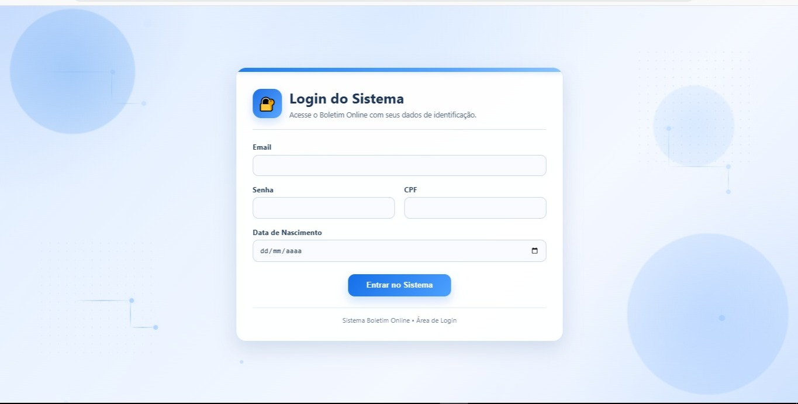
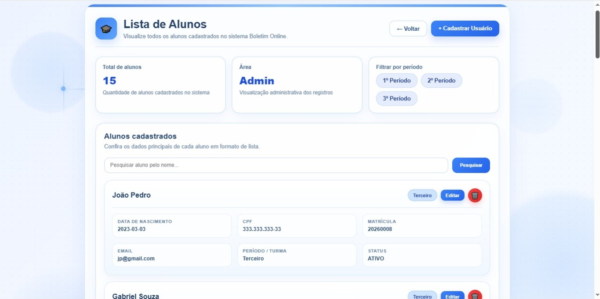

# 📚 Boletim Online


Sistema web de gerenciamento escolar desenvolvido como **Projeto de Conclusão do Curso Técnico em Informática da FAETEC**.

O funcionamento do sistema foi inspirado no modelo de gerenciamento acadêmico utilizado pela FAETEC, sendo desenvolvido do zero para aplicar, na prática, conhecimentos de desenvolvimento web, banco de dados e arquitetura MVC.

---

# 🎯 Objetivo

Desenvolver um sistema web capaz de gerenciar alunos, professores e administradores, permitindo o controle acadêmico de forma organizada e intuitiva.

O projeto foi desenvolvido para consolidar os conhecimentos adquiridos durante o Curso Técnico em Informática, aplicando tecnologias utilizadas no mercado de desenvolvimento Java.

---

# 🚀 Tecnologias Utilizadas

| Categoria | Tecnologias |
|-----------|-------------|
| **Back-end** | Java, Spring Boot, Spring Data JPA |
| **Front-end** | HTML5, CSS3, JavaScript, Thymeleaf |
| **Banco de Dados** | MySQL |
| **Ferramentas** | IntelliJ IDEA, MySQL Workbench, Git e GitHub |

---

# ✨ Funcionalidades

- Sistema de Login
- Painel Administrativo
- Cadastro de Alunos
- Cadastro de Professores
- Cadastro de Administradores
- Gerenciamento de Disciplinas
- Controle de Notas
- Controle de Frequência
- Controle de Aprovação
- Banco de Dados Relacional
- Controle de Usuários
- Interface Responsiva
- Arquitetura MVC

---

# 👥 Níveis de Acesso

### 👨‍💼 Administrador

- Gerenciar usuários
- Cadastrar alunos
- Cadastrar professores
- Gerenciar disciplinas
- Alterar configurações do sistema

### 👨‍🏫 Professor

- Visualizar disciplinas
- Lançar notas
- Registrar frequência
- Editar avaliações

### 👨‍🎓 Aluno

- Consultar boletim
- Visualizar notas
- Consultar frequência

---

# 🏗️ Arquitetura

O projeto foi desenvolvido utilizando a arquitetura **MVC (Model-View-Controller)**.

```
src
├── controller
├── model
├── repository
├── service
├── templates
└── static
```

---

# 📸 Capturas de Tela

## 🔐 Tela de Login

A autenticação é realizada utilizando e-mail, senha, CPF e data de nascimento.



---

## 🛠️ Painel Administrativo

*(Adicionar imagem)*

```markdown

```

---

## 👤 Cadastro de Usuário

*(Adicionar imagem)*

```markdown

```

---

## 📚 Lista de Alunos

*(Adicionar imagem)*

```markdown

```

---

## 👨‍🏫 Lista de Professores

*(Adicionar imagem)*

```markdown

```

---

## 👤 Minha Conta

*(Adicionar imagem)*

```markdown

```

---

# ▶️ Como Executar

1. Clone este repositório.
2. Configure o banco de dados MySQL.
3. Atualize as credenciais no arquivo `application.properties`.
4. Execute o projeto utilizando o IntelliJ IDEA.
5. Acesse:

```
http://localhost:8080
```

---

# 👨‍💻 Desenvolvedor

**Jhonatan Miguel Souza Silva**

Curso Técnico em Informática — FAETEC

GitHub:
https://github.com/jmiguelsouza

---

# 📄 Licença

Projeto desenvolvido exclusivamente para fins acadêmicos.
